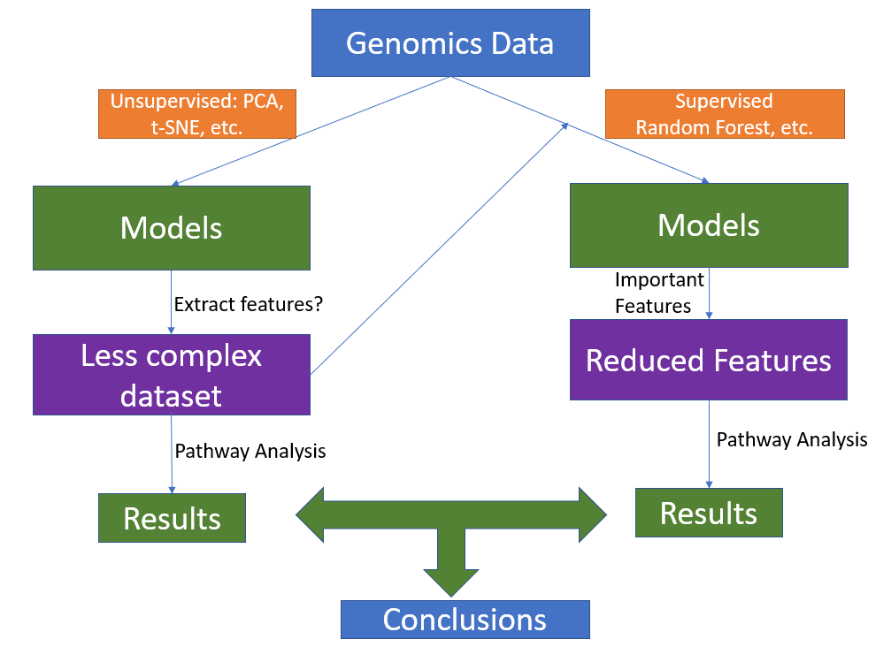

# 2020 CSHL Codeathon
## *Exploring Feature Selection for Genomics Expression Profile* (draft version)

### Motivation: 

NCI-DOE collaboration (https://github.com/ravichas/ML-TC1) show that genomic expression profiles collected from different cancer sites/types can be modeled (classification) using the deep-learning (convolutional neural network) method. The method works well for a balanced dataset. Neural network method doesn't answer what features (i.e. genes) are important for the classification? A project to explore feature selection for genomics data could be useful for cancer research communities.

### Complexity of the problem and open questions:

Genomics data is high dimensional in terms of the number of genes/probes/features. Models constructed from a high dimensional Omics data will be complex and difficult to explain. Identifying important features/genes is as important as building high accuracy models. Keeping in mind that genes do not work alone, pathway-based analysis could be used to 

## Overview 
* Data collection 
  * Data source will be Genmic Data Commons (https://portal.gdc.cancer.gov/). Several datasets (cancer sites that have same lineages and different lineages) will be constructed.
           * Data collection will be based on our previous effort (details available from https://github.com/ravichas/ML-TC1/blob/master/TC1-dataprep.ipynb)
* Datasets created in the previous step will be used to construct/compare several supervised and unsupervised models (tSNE, PCA,  
* Important features from these models will be compared with experimental findings
* Summarize the conclusions
* Provide list of open questions and propose future directions

### Team

* Andrew Weisman
* Anwar Khan
* Aishwarya Mandava
* Medina Colic
* Regina Umarova
* Sarangan Ravichandran (Github: ; Email: saka.ravi@gmail.com)
*  S. E. Krumme
